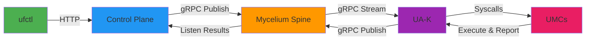

# Underleaf Client

[](https://go.dev/)
[](LICENSE)

**Underleaf Client** provides both a CLI tool (`ufctl`) and an agent binary (`underleaf_agent`) for managing distributed edge servers through the Underleaf control plane.

## Features

- 🚀 **Remote Command Execution** - Execute commands across multiple servers with real-time status updates
- 📊 **Job Management** - Track and monitor command execution jobs with detailed per-server results
- 🔄 **Mycelium Spine Integration** - gRPC-based control fabric for low-latency command/control and targeted messaging
- 🧩 **UA-Managed Components (UMCs)** - Extensible userland architecture running on top of the Underleaf Agent Kernel (UA-K)
- 🛠️ **Local Agent Mode** - Run agent locally for development and testing
- 📝 **Rich CLI Output** - Beautiful terminal UI with tables, spinners, and colored output
- 🔐 **Secure Authentication** - JWT-based authentication with Auth0 integration
- ⚙️ **Configuration Management** - Centralized config distribution via Mycelium Spine

## Installation

### Build Types

Underleaf Client offers two types of pre-built binaries:

| Build Type | Tag | Environment | Use Case |
|------------|-----|-------------|----------|
| **Production** | `v*` (e.g., `v1.0.0`) | underleafapp.com | Stable releases for production use |
| **Development** | `dev` | underleafdev.com | Latest features from `develop` branch |

Production builds connect to the production control plane, while development builds connect to the staging environment for testing new features.

### From Source

```bash
# Clone the repository
git clone https://github.com/ambientlabscomputing/underleaf_client.git
cd underleaf_client

# Build both binaries
go build -o ufctl ./cmd/ufctl
go build -o underleaf_agent ./cmd/underleaf_agent

# Optional: Install to $GOPATH/bin
go install ./cmd/ufctl
go install ./cmd/underleaf_agent
```

### Binary Releases

Download pre-built binaries from the [Releases](https://github.com/ambientlabscomputing/underleaf_client/releases) page.

> 💡 **Finding the latest version**: Check the [Releases page](https://github.com/ambientlabscomputing/underleaf_client/releases/latest) or use `curl -s https://api.github.com/repos/ambientlabscomputing/underleaf_client/releases/latest | grep tag_name` to get the latest version tag.

#### Quick Install - Production (Latest Stable Release)

Production releases are tagged with version numbers (e.g., `v1.0.0`) and connect to **underleafapp.com** endpoints.

> 💡 **Note**: To use agent daemon mode (`ufctl agent start -d`), you need to install both `ufctl` and `underleaf_agent` binaries.

**Linux (AMD64)**
```bash
# Option 1: Specify version manually
VERSION="v1.0.0"  # Replace with latest version from releases page

# Install ufctl
curl -L -o ufctl https://github.com/ambientlabscomputing/underleaf_client/releases/download/${VERSION}/ufctl-linux-amd64
chmod +x ufctl
sudo mv ufctl /usr/local/bin/

# Install underleaf_agent (required for daemon mode)
curl -L -o underleaf_agent https://github.com/ambientlabscomputing/underleaf_client/releases/download/${VERSION}/underleaf_agent-linux-amd64
chmod +x underleaf_agent
sudo mv underleaf_agent /usr/local/bin/

# Option 2: Auto-detect latest version
VERSION=$(curl -s https://api.github.com/repos/ambientlabscomputing/underleaf_client/releases/latest | grep '"tag_name":' | sed -E 's/.*"([^"]+)".*/\1/')

# Install ufctl
curl -L -o ufctl https://github.com/ambientlabscomputing/underleaf_client/releases/download/${VERSION}/ufctl-linux-amd64
chmod +x ufctl
sudo mv ufctl /usr/local/bin/

# Install underleaf_agent (required for daemon mode)
curl -L -o underleaf_agent https://github.com/ambientlabscomputing/underleaf_client/releases/download/${VERSION}/underleaf_agent-linux-amd64
chmod +x underleaf_agent
sudo mv underleaf_agent /usr/local/bin/
```

**Linux (ARM64)**
```bash
# Option 1: Specify version manually
VERSION="v1.0.0"  # Replace with latest version from releases page

# Install ufctl
curl -L -o ufctl https://github.com/ambientlabscomputing/underleaf_client/releases/download/${VERSION}/ufctl-linux-arm64
chmod +x ufctl
sudo mv ufctl /usr/local/bin/

# Install underleaf_agent (required for daemon mode)
curl -L -o underleaf_agent https://github.com/ambientlabscomputing/underleaf_client/releases/download/${VERSION}/underleaf_agent-linux-arm64
chmod +x underleaf_agent
sudo mv underleaf_agent /usr/local/bin/

# Option 2: Auto-detect latest version
VERSION=$(curl -s https://api.github.com/repos/ambientlabscomputing/underleaf_client/releases/latest | grep '"tag_name":' | sed -E 's/.*"([^"]+)".*/\1/')

# Install ufctl
curl -L -o ufctl https://github.com/ambientlabscomputing/underleaf_client/releases/download/${VERSION}/ufctl-linux-arm64
chmod +x ufctl
sudo mv ufctl /usr/local/bin/

# Install underleaf_agent (required for daemon mode)
curl -L -o underleaf_agent https://github.com/ambientlabscomputing/underleaf_client/releases/download/${VERSION}/underleaf_agent-linux-arm64
chmod +x underleaf_agent
sudo mv underleaf_agent /usr/local/bin/
```

**macOS (ARM64 - M1/M2/M3)**
```bash
# Option 1: Specify version manually
VERSION="v1.0.0"  # Replace with latest version from releases page

# Install ufctl
curl -L -o ufctl https://github.com/ambientlabscomputing/underleaf_client/releases/download/${VERSION}/ufctl-darwin-arm64
chmod +x ufctl
sudo mv ufctl /usr/local/bin/

# Install underleaf_agent (required for daemon mode)
curl -L -o underleaf_agent https://github.com/ambientlabscomputing/underleaf_client/releases/download/${VERSION}/underleaf_agent-darwin-arm64
chmod +x underleaf_agent
sudo mv underleaf_agent /usr/local/bin/

# Option 2: Auto-detect latest version
VERSION=$(curl -s https://api.github.com/repos/ambientlabscomputing/underleaf_client/releases/latest | grep '"tag_name":' | sed -E 's/.*"([^"]+)".*/\1/')

# Install ufctl
curl -L -o ufctl https://github.com/ambientlabscomputing/underleaf_client/releases/download/${VERSION}/ufctl-darwin-arm64
chmod +x ufctl
sudo mv ufctl /usr/local/bin/

# Install underleaf_agent (required for daemon mode)
curl -L -o underleaf_agent https://github.com/ambientlabscomputing/underleaf_client/releases/download/${VERSION}/underleaf_agent-darwin-arm64
chmod +x underleaf_agent
sudo mv underleaf_agent /usr/local/bin/
```

**macOS (Intel)**
```bash
# Option 1: Specify version manually
VERSION="v1.0.0"  # Replace with latest version from releases page

# Install ufctl
curl -L -o ufctl https://github.com/ambientlabscomputing/underleaf_client/releases/download/${VERSION}/ufctl-darwin-amd64
chmod +x ufctl
sudo mv ufctl /usr/local/bin/

# Install underleaf_agent (required for daemon mode)
curl -L -o underleaf_agent https://github.com/ambientlabscomputing/underleaf_client/releases/download/${VERSION}/underleaf_agent-darwin-amd64
chmod +x underleaf_agent
sudo mv underleaf_agent /usr/local/bin/

# Option 2: Auto-detect latest version
VERSION=$(curl -s https://api.github.com/repos/ambientlabscomputing/underleaf_client/releases/latest | grep '"tag_name":' | sed -E 's/.*"([^"]+)".*/\1/')

# Install ufctl
curl -L -o ufctl https://github.com/ambientlabscomputing/underleaf_client/releases/download/${VERSION}/ufctl-darwin-amd64
chmod +x ufctl
sudo mv ufctl /usr/local/bin/

# Install underleaf_agent (required for daemon mode)
curl -L -o underleaf_agent https://github.com/ambientlabscomputing/underleaf_client/releases/download/${VERSION}/underleaf_agent-darwin-amd64
chmod +x underleaf_agent
sudo mv underleaf_agent /usr/local/bin/
```

**Windows (PowerShell)**
```powershell
# Option 1: Specify version manually
$VERSION = "v1.0.0"  # Replace with latest version from releases page

# Install ufctl
Invoke-WebRequest -Uri "https://github.com/ambientlabscomputing/underleaf_client/releases/download/$VERSION/ufctl-windows-amd64.exe" -OutFile "ufctl.exe"
# Move to a directory in your PATH

# Install underleaf_agent (required for daemon mode)
Invoke-WebRequest -Uri "https://github.com/ambientlabscomputing/underleaf_client/releases/download/$VERSION/underleaf_agent-windows-amd64.exe" -OutFile "underleaf_agent.exe"
# Move to a directory in your PATH

# Option 2: Auto-detect latest version
$VERSION = (Invoke-RestMethod -Uri "https://api.github.com/repos/ambientlabscomputing/underleaf_client/releases/latest").tag_name

# Install ufctl
Invoke-WebRequest -Uri "https://github.com/ambientlabscomputing/underleaf_client/releases/download/$VERSION/ufctl-windows-amd64.exe" -OutFile "ufctl.exe"
# Move to a directory in your PATH

# Install underleaf_agent (required for daemon mode)
Invoke-WebRequest -Uri "https://github.com/ambientlabscomputing/underleaf_client/releases/download/$VERSION/underleaf_agent-windows-amd64.exe" -OutFile "underleaf_agent.exe"
# Move to a directory in your PATH
```

#### Quick Install - Development (Latest Dev Build)

Development builds are automatically built from the `develop` branch and connect to **underleafdev.com** endpoints.

> ⚠️ **Warning**: Development builds are bleeding edge and may contain unstable features. Use production releases for production workloads.

**Linux (AMD64)**
```bash
# Install ufctl
curl -L -o ufctl https://github.com/ambientlabscomputing/underleaf_client/releases/download/dev/ufctl-linux-amd64
chmod +x ufctl
sudo mv ufctl /usr/local/bin/

# Install underleaf_agent (required for daemon mode)
curl -L -o underleaf_agent https://github.com/ambientlabscomputing/underleaf_client/releases/download/dev/underleaf_agent-linux-amd64
chmod +x underleaf_agent
sudo mv underleaf_agent /usr/local/bin/
```

**Linux (ARM64)**
```bash
# Install ufctl
curl -L -o ufctl https://github.com/ambientlabscomputing/underleaf_client/releases/download/dev/ufctl-linux-arm64
chmod +x ufctl
sudo mv ufctl /usr/local/bin/

# Install underleaf_agent (required for daemon mode)
curl -L -o underleaf_agent https://github.com/ambientlabscomputing/underleaf_client/releases/download/dev/underleaf_agent-linux-arm64
chmod +x underleaf_agent
sudo mv underleaf_agent /usr/local/bin/
```

**macOS (ARM64 - M1/M2/M3)**
```bash
# Install ufctl
curl -L -o ufctl https://github.com/ambientlabscomputing/underleaf_client/releases/download/dev/ufctl-darwin-arm64
chmod +x ufctl
sudo mv ufctl /usr/local/bin/

# Install underleaf_agent (required for daemon mode)
curl -L -o underleaf_agent https://github.com/ambientlabscomputing/underleaf_client/releases/download/dev/underleaf_agent-darwin-arm64
chmod +x underleaf_agent
sudo mv underleaf_agent /usr/local/bin/
```

**macOS (Intel)**
```bash
# Install ufctl
curl -L -o ufctl https://github.com/ambientlabscomputing/underleaf_client/releases/download/dev/ufctl-darwin-amd64
chmod +x ufctl
sudo mv ufctl /usr/local/bin/

# Install underleaf_agent (required for daemon mode)
curl -L -o underleaf_agent https://github.com/ambientlabscomputing/underleaf_client/releases/download/dev/underleaf_agent-darwin-amd64
chmod +x underleaf_agent
sudo mv underleaf_agent /usr/local/bin/
```

**Windows (PowerShell)**
```powershell
# Install ufctl
Invoke-WebRequest -Uri "https://github.com/ambientlabscomputing/underleaf_client/releases/download/dev/ufctl-windows-amd64.exe" -OutFile "ufctl.exe"
# Move to a directory in your PATH

# Install underleaf_agent (required for daemon mode)
Invoke-WebRequest -Uri "https://github.com/ambientlabscomputing/underleaf_client/releases/download/dev/underleaf_agent-windows-amd64.exe" -OutFile "underleaf_agent.exe"
# Move to a directory in your PATH
```

#### Verify Installation

```bash
# Check ufctl version and configuration
ufctl auth status

# Verify underleaf_agent is installed (required for daemon mode)
which underleaf_agent
underleaf_agent version

# For production builds, config will show:
# - API: https://api.underleafapp.com/api/v1/servers
# - Spine: spine.underleafapp.com:443
# - UCRS: https://api.underleafapp.com/api/v1/registry

# For development builds, config will show:
# - API: https://api.underleafdev.com/api/v1/servers
# - Spine: spine.underleafdev.com:443
# - UCRS: https://api.underleafdev.com/api/v1/registry
```

## Quick Start

### 1. Configure the CLI

Copy the example configuration:

```bash
cp config.example.yaml config.yaml
```

Or create `config.yaml` manually:

```yaml
api:
  base_url: http://localhost:8080/api/v1/servers
auth:
  token: ""  # Will be set after login
mycelium_spine:
  endpoint: localhost:9090
local:
  server_id: ""  # Will be set after registration
  server_name: my-server
version: 0.0.0
```

### 2. Authenticate

```bash
# Authenticate using OAuth2 device code flow
ufctl auth login

# Check authentication status
ufctl auth status

# Register as a server (for running agent)
ufctl register
```

### 3. Run Commands

```bash
# Execute a command on a specific server (waits for completion)
ufctl servers exec server-123 -- echo "Hello World"

# Execute on all servers
ufctl servers exec all -- uptime

# Fire-and-forget mode
ufctl servers exec server-123 -d -- long-running-task

# With environment variables and timeout
ufctl servers exec server-123 -e FOO=bar -t 60 -- ./deploy.sh
```

### 4. Monitor Jobs

```bash
# List all jobs
ufctl jobs list

# Get job status
ufctl jobs status <job-id>

# Watch job in real-time
ufctl jobs status <job-id> --watch

# Show full command output
ufctl jobs status <job-id> --output
```

### 5. Run Local Agent

```bash
# Start agent in development mode (foreground)
ufctl agent start --dev

# Start agent in daemon mode (background - requires underleaf_agent binary)
ufctl agent start -d

# Stop agent
ufctl agent stop

# Check agent status
ufctl agent status

# View agent logs
ufctl agent logs
```

## Architecture

### Components

**ufctl** - CLI tool for developers and operators
- Command execution and job management
- Server listing and status checks
- Local agent control
- Configuration management

**underleaf_agent** - Server-side agent binary
- **UA-K (Underleaf Agent Kernel)**: The minimal trusted core that owns identity, execution authority, cluster truth, and secrets.
- **UMCs (UA-Managed Components)**: Userland subsystems (like Deployment Engine, Cron Scheduler, MMA) installed and supervised by UA-K.
- Receives commands via Mycelium Spine
- Executes commands with timeout/env controls
- Reports results back to control plane
- Manages local configuration snapshots

### Communication Flow



## CLI Commands

### Servers

```bash
ufctl servers list                         # List all servers
ufctl servers list --status online         # Filter by status
ufctl servers list --location us-east-1    # Filter by location
ufctl servers describe <server-id>         # Describe a specific server
ufctl servers exec <selector> -- <cmd>     # Execute command
ufctl servers status <server-id>           # Get server status
ufctl servers logs <server-id>             # View server logs
ufctl servers metrics <server-id>          # View current metrics
ufctl servers activity <server-id>         # View activity feed
ufctl servers update <server-id>           # Update server metadata
```

### Jobs

```bash
ufctl jobs list                            # List all jobs
ufctl jobs status <job-id>                 # Get job status
ufctl jobs status <job-id> --watch         # Watch job until completion
ufctl jobs status <job-id> --output        # Show full stdout/stderr
```

### Local

```bash
ufctl auth login                     # Authenticate with OAuth2 device flow
ufctl auth logout                    # Clear authentication token
ufctl auth status                    # Check authentication status
ufctl register                       # Register this machine as a server
ufctl config                         # View current configuration
ufctl config --edit                  # Edit configuration file
ufctl agent start [-d] [-p PORT]     # Start local agent
ufctl agent stop                     # Stop local agent
ufctl agent restart                  # Restart local agent
ufctl agent status                   # Check agent status
ufctl agent logs                     # View agent logs
```

## Configuration

### CLI Configuration

Location: `./config.yaml` or `~/.underleaf/config.yaml`

```yaml
api:
  base_url: http://localhost:8080/api/v1/servers  # Control plane API URL
auth:
  token: eyJhbGc...                                # JWT authentication token (from login)
mycelium_spine:
  endpoint: localhost:9090                         # gRPC endpoint for Mycelium Spine
local:
  server_id: 62db5115-b200-469f-bc8b-4ce7         # This server's ID (for agent mode)
  server_name: my-server                           # Human-readable server name
version: 0.0.0
```

### Agent Configuration

The agent uses the same configuration file format. When running as an agent:
- `local.server_id` identifies this server
- `mycelium_spine.endpoint` specifies where to connect
- Configuration updates are received automatically via Mycelium Spine

### Environment Variables

```bash
UNDERLEAF_API_URL=http://localhost:8080/api/v1
UNDERLEAF_TOKEN=your-jwt-token
UNDERLEAF_SPINE_ENDPOINT=localhost:9090
UNDERLEAF_SERVER_ID=your-server-id
```

## Development

### Project Structure

```mermaid
graph TD
    Root[underleaf_client/]
    
    Root --> Cmd[cmd/]
    Cmd --> Ufctl[ufctl/ - CLI binary]
    Cmd --> Agent[underleaf_agent/ - Agent binary]
    
    Root --> Internal[internal/]
    Internal --> AgentPkg[agent/ - Agent server and lifecycle]
    Internal --> Spine[spine/ - Mycelium Spine client wrapper]
    Internal --> CLI[cli/ - CLI root command and flags]
    Internal --> Commands[commands/ - CLI subcommands]
    Commands --> Jobs[jobs/ - Job management]
    Commands --> Local[local/ - Auth, agent, config]
    Commands --> Servers[servers/ - Server management]
    Internal --> Config[config/ - Configuration loading]
    Internal --> PolicyMgr[policy_manager/ - Policy snapshot management]
    Internal --> ControlPlane[controlplane/ - API clients]
    Internal --> Exec[exec/ - Command execution engine]
    Internal --> Logging[logging/ - Structured logging]
    Internal --> Server[server/ - Domain models]
    Internal --> UI[ui/ - Terminal UI components]
    
    Root --> Pkg[pkg/]
    Pkg --> Version[version/ - Version information]
    
    Root --> Guides[guides/ - Development guides]
    
    style Root fill:#2196F3
    style Cmd fill:#4CAF50
    style Internal fill:#FF9800
    style Pkg fill:#9C27B0
    style Guides fill:#607D8B
```



### Running Tests

```bash
# Run all tests
go test ./...

# Run with coverage
go test -coverprofile=coverage.out ./...
go tool cover -html=coverage.out

# Run specific package
go test ./internal/exec/...
```

### Building

```bash
# Build CLI (development defaults)
go build -o ufctl ./cmd/ufctl

# Build agent
go build -o underleaf_agent ./cmd/underleaf_agent

# Build with custom environment (production)
make build-cli \
  VERSION=1.0.0 \
  API_BASE_URL=https://api.underleafapp.com/api/v1/servers \
  SPINE_ENDPOINT=spine.underleafapp.com:443 \
  UCRS_BASE_URL=https://api.underleafapp.com/api/v1/registry

# Build with custom environment (development)
make build-cli \
  VERSION=dev \
  API_BASE_URL=https://api.underleafdev.com/api/v1/servers \
  SPINE_ENDPOINT=spine.underleafdev.com:443 \
  UCRS_BASE_URL=https://api.underleafdev.com/api/v1/registry
```

**Check Build Configuration**
```bash
# View embedded defaults
./ufctl config view

# The output shows which environment the binary was built for
```

## Usage Examples

### Execute Commands

```bash
# Simple command
ufctl servers exec server-abc123 -- whoami

# Multi-server targeting
ufctl servers exec all -- df -h

# With environment variables
ufctl servers exec production -- printenv | grep -e FOO -e BAR

# Long-running task (detached)
ufctl servers exec server-123 -d -- ./backup.sh
```

### Monitor Job Progress

```bash
# Execute and watch automatically (default behavior)
ufctl servers exec server-123 -- ./deploy.sh

# Check status later
JOB_ID=abc-123-xyz
ufctl jobs status $JOB_ID

# Watch until completion
ufctl jobs status $JOB_ID --watch

# See full output
ufctl jobs status $JOB_ID --output
```

### Agent Operations

```bash
# Start agent in foreground (for development)
ufctl agent start

# Start agent in background
ufctl agent start -d

# Check if agent is running
ufctl agent status

# Stop background agent
ufctl agent stop

# View agent logs
tail -f /var/log/underleaf_agent/agent.log
```

## Mycelium Spine Integration

The system uses Mycelium Spine, a gRPC-based control fabric, for real-time communication:

### QoS Classes

- `COMMAND` - High-priority, low-latency execution requests
- `CONTROL` - Configuration updates and cluster membership changes
- `TELEMETRY` - High-throughput metrics and logs

### Message Flow

1. CLI dispatches command via HTTP to control plane
2. Control plane publishes to Mycelium Spine via gRPC
3. UA-K receives command via bidirectional gRPC stream
4. UA-K delegates execution to the appropriate UMC (e.g., Deployment Engine)
5. UMC executes command and reports result to UA-K
6. UA-K publishes result back to Mycelium Spine
7. Control plane updates job status
8. CLI polls job status for completion

## Troubleshooting

### Agent Not Receiving Commands

```bash
# Check agent is running
ufctl agent status

# View agent logs
ufctl agent logs

# Check Mycelium Spine connection
# Look for "spine client started" in logs

# Verify configuration
ufctl config
```

### Authentication Issues

```bash
# Check authentication status
ufctl auth status

# Re-authenticate using OAuth2 device flow
ufctl auth login

# Logout and clear token
ufctl auth logout

# Check token expiry (JWT tokens typically expire after 24 hours)
```

### Command Timeouts

```bash
# Increase timeout (default is server-defined)
ufctl servers exec server-123 -t 300 -- long-task.sh

# Check job status for timeout errors
ufctl jobs status <job-id> --output
```

## Contributing

Contributions are welcome! Please see [CONTRIBUTING.md](CONTRIBUTING.md) for guidelines.

## Developer Guides

- [**Dev Mode: Local UMC Development**](docs/DEV_MODE.md) — How to build and run UMCs from local paths (bypassing UCRS), with hot-reload on rebuild
- [**Deployment Compiler**](docs/DEPLOYMENT_COMPILER.md) — Architecture of the deployment engine compiler
- [**Deploy Commands**](docs/DEPLOY_COMMANDS.md) — Reference for deploy command syntax

### Code Style

- Follow standard Go conventions
- Use `gofmt` for formatting
- Add tests for new functionality
- Update documentation for API changes

### Submitting Changes

1. Fork the repository
2. Create a feature branch (`git checkout -b feature/amazing-feature`)
3. Commit your changes (`git commit -m 'Add amazing feature'`)
4. Push to the branch (`git push origin feature/amazing-feature`)
5. Open a Pull Request

## License

This project is licensed under the MIT License - see the [LICENSE](LICENSE) file for details.

## Support

- Documentation: [docs.ambientlabs.io](https://docs.ambientlabs.io)
- Issues: [GitHub Issues](https://github.com/ambientlabscomputing/underleaf_client/issues)
- Email: support@ambientlabs.io

## Acknowledgments

Built with:
- [Cobra](https://github.com/spf13/cobra) - CLI framework
- [Bubble Tea](https://github.com/charmbracelet/bubbletea) - Terminal UI
- [Lipgloss](https://github.com/charmbracelet/lipgloss) - Style definitions
- [Viper](https://github.com/spf13/viper) - Configuration management
